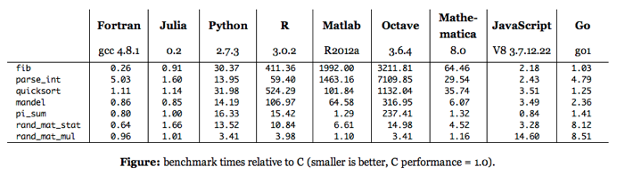
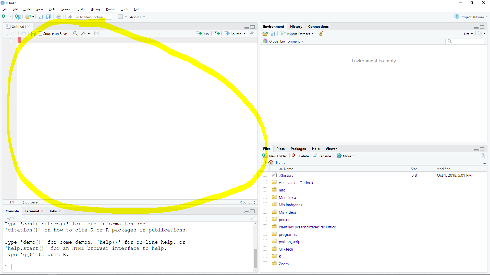

# R y RStudio

### ¿Qué es R? 

"[R](r_programming) es un lenguaje de programación interpretado, de distribución
libre, bajo Licencia GNU, y se mantiene en un ambiente para el cómputo
estadístico y gráfico..."

Destacando que:

- Interpretado: No hay compilación. El lenguaje tiene un REPL donde se puede
ejecutar el código directamente.
- Distribución libre: Se distribuye bajo una licensia (GPL-3)[gpl]. No tiene
ningún costo ni garantía.

Además es bueno notar las siguientes características del lenguaje:

- Debilmente tipado: No existen definiciones formales de tipo de dato. Los
tipos primitivos se heredan directamente de los tipos fundamentales de C.
- Dinámicamente tipado: No hay declaración de tipo de datos, por lo tanto,
no tienen un tipo fijo y puede ser cohercionado.
- Lenguaje fundamentalmente funcional, aunque tiene soporte para procedural y 
orientado a objetos.
- Es la primera opción de publicación de nuevos métodos estadísticos por la
académia.

Estas características le otorgan una posición intermedia entre usabilidad y
performance que ha sido muy valorada por la comunidad estadística. La sintáxis
del lenguaje es muy intuitiva y orientada a los datos. Además, cuenta con un
amplio soporte para visualización de datos. Por los estas razones es considerada
la _lingua franca_ del análisis estadístico.

Otros lenguajes que compiten en este ámbito con R son, Python, Scala, C++ y
Julia, cada uno con diferentes características y particularidades.

### ¿Por qué y cuando usar R?

R es una excelente opción cuando se requiere análisis estadístico, performance
intermedio, o bien, cuando se requieren hacer visualizaciones de datos
estáticas. En cambio, se debe evitar R si se require:

- Muchos datos (> 16GB).
- Desarrollo web.
- Experiencia de usuario.
- Alto performance.

Debido a que es un lenguaje interpretado, débilmente y dinámicamente tipado,
el tiempo de desarrollo de un programa simple que ejecute acciones concretas
es *mucho menor* que el tiempo de desarrollo en un lenguaje más formal, como
Java o C++. A cambio de esto, el performance de R es mucho menor que un lenguaje
compilado, y es incluso menor que el de otros lenguajes interpretados. Para
solventar esto, R tiene soporte para generar nuestras funciones en otros
lenguajes (C, Java, C++, Fortran, Python) y ejecutarlas dentro del runtime de 
R, aunque este procedimiento escapa por mucho el alcance de este curso.

A pesar de que el performance de R no es competencia para otros lenguajes,
supera por mucho a otras herramientas gráficas como Excel y Access.
Adicional al performance, existe una clara ventaja de cambiar nuestro esquema de
trabajo de una interfaz gráfica a un lenguaje de programación y es la
*reproducibilidad*, es decir, las instrucciones escritas de un procedimiento son
siempre más eficientes que el uso del mouse, ya que generan menos errores
por parte del usuario. Acompañando a la reproducibilidad, tenemos el control
de versiones, ya que podemos detectar la historia de los cambios en las cosas
escritas.


### Benchmark
#### Runtime



<iframe width="560" height="315" frameborder="0"
  allow="autoplay; encrypted-media" allowfullscreen
  src="https://www.youtube.com/embed/lGjWfMzZFwo"></iframe>

#### Reproducibilidad y control de versiones.

En HiTo tenemos nuestra propia [plataforma](gitlab) de control de versiones para
código. Para EXCEL tenemos que hacer "respaldos" periódicamente.


## Instalación

### Instalación del interprete

Todos los detalles de la instalación están incluídos en el portal (CRAN)[cran].
A continuación les dejamos un resumen para los principales sistemas operativos:

#### Windows

1. Entrar a (CRAN)[cran].
2. Seguir el link (Download R for Windows)[download_cran].
3. Seguir el link (base)[cran_base].
4. Descargar la última versión de R en el (link)[download_r].
5. Ejecutar el instalador con las opciones default.

### Instalación de RStudio

1. Entrar a la (página de descarga de RStudio)[rstudio].
2. Descargar la última versión de (Rstudio para Windows)[download_rstudio]
3. Ejecutar el instalador con las opciones default.

### Instalación de paquetes

Una vez que se tiene instalado el _environment_ de R, podemos instalar las
paqueterías de diferentes formas. En este curso detallamos la instalación desde
RStudio y desde la CLI. Ambos métodos requieren conexión a internet.

#### Instalación desde la CLI

Básicamente todo se encuentra detallado en la documentación de la función
`install.packages`. Nosotros nos limitaremos a usar su funcionalidad básica.
Para ello abrimos una consola de R y escribimos el siguiente comando

```{r instalacion_paquetes, eval = FALSE}
install.packages(c("data.table", "magrittr", "lubridate"))
```

#### Instalación desde RStudio

Hay dos métodos:

1. Ir a la sección *Packages* (Ctrl + 7).
2. Click en *Install*.
3. En el input field *Packages* escribir el nombre de los paquetes requeridos.
4. Click en el botón de *Install*.

O bien:

1. Ir al menu *Tools*.
2. Ir a la opción *Install packages...*.
3. En el input field *Packages* escribir el nombre de los paquetes requeridos.
4. Click en el botón de *Install*.

## Tour por RStudio

RStudio es un IDE (Integrated Development Environment) para R. Es decir, es una
interfaz gráfica amigable para el desarrollo de código de R, e.g. integración
con control de versiones, integración con paquetes de desarrollo, esqueletos y
boilerplates, shortcuts, code highlight, integración con compiladores, linting,
integración con bases de datos, paneles para gráficos estáticos e interactivos,
adminsitración de paquetes, entre otras facilidades.

### Panel del CLI

Este panel es una sesión de R y podemos ejecutar cualquier comando directamente
en ella. Para enfocarla usamos el shortcut CTRL + 2,


### Panel de script

Podemos crear un script nuevo con Ctrl + Shift + N, o bien, enfocar el script
actual con Ctrl + 1. Una vez en el script, podemos enviar el código de un bloque
al CLI con CTRL + ENTER.



### Environment

Las variables declaradas en la sesión están listadas en el environment. Podemos
enfocarlo con CTRL + 8.


### Paneles miscelaneos

Otros paneles en RStudio son:

- Files: Nos permite ver los archivos del proyecto, renombrarlos y eliminarlos.
- Plots: Visualizaciones estáticas.
- Packages: Administración de paquetes. Instalar, remover, actualizar.
- Help: Sistema de ayuda.
- Viewer: Visualizaciones interactivas.
- History: Historial de comandos ejecutados.
- Connections: Conexiones a bases de datos.
- Build: Estatus de compilaciones.
- Git: Sistema de control de versiones.
- Terminal: CLI del sistema operativo.
- Jobs: Tareas en segundo plano..

Algunos solo se encuentran disponibles dentro de proyectos.

### Sistema de ayuda

Se puede acceder al sistema de ayuda con los siguientes méetodos:

- En el panel *Help* (CTRL + 3).
- Colocando el cursor sobre una función y apretando F1.
- Con la función de ayuda `?` o búsqueda en la ayuda `??`.

La documentación de R es muy completa y en cada página de ayuda se detalla para
que sirve cada función, cuales son sus argumentos y cual es el output esperado.
Por ejemplo, ejecutar el siguiente comando en la consola:

````{r help, eval = FALSE}
?c
```

O bien:

```{r fuzzy_help, eval = FALSE}
??vector
```

[r_programming]: https://cran.r-project.org/doc/contrib/Santana_El_arte_de_programar_en_R.pdf
[gpl]: https://www.gnu.org/licenses/gpl-3.0.html
[gitlab]: https://git1.hitoad.com.mx/riesgos/
[cran]: https://cran.r-project.org/
[download_cran]: https://cran.r-project.org/bin/windows/
[cran_base]: https://cran.r-project.org/bin/windows/base/
[download_r]: https://cran.r-project.org/bin/windows/base/R-3.5.1-win.exe
[rstudio]: https://www.rstudio.com/products/rstudio/download/
[download_rstudio]: https://download1.rstudio.org/RStudio-1.1.456.exe