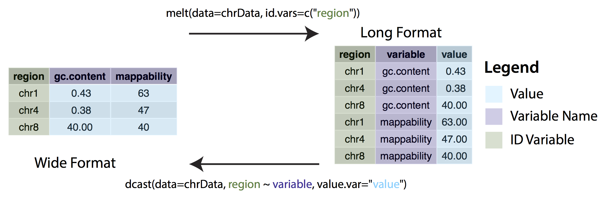

# Tidy Data

> "Todos los __*tidy datasets*__ se parecen unos a otros,
pero todos los __*untidy datasets*__ lo son a su manera."
> 
> --- Hadley Wickham

```{r load_packages, echo=FALSE, warning=FALSE, message=FALSE}
library(magrittr)
library(data.table)
library(knitr)
library(lubridate)
library(jsonlite)
library(lubridate)
```


## Necesidad de ordenar la información antes del análisis

Los que han trabajado analizando datos recordarán que una de las grandes dificultades 
es la *limpieza* de los mismos. Sin embargo otra práctica escencial que no se debe olvidar 
antes de poder realizar cualquier tipo de cálculo o análisis es su *ordenamiento*.

Esta sección se dedicará a explicar la filosofía del __tidy data__, la cual consiste 
en exponer una forma de ordenar los datos a través de reorganizar los distintos datos que se
puedan encontrar en el día a día.

Primero introduciremos algunos terminos para poder ejemplificar mejor algunos de
los problemas más comunes en la organización de los datos.


### Definiciones
- __Dataset:__ Colección de *valores*, los cuales pertenecen a una *observación* 
y a una *variable*. Normalmente se encuentran registrados de manera tabular con filas y 
*columnas*.
- __Variable:__ Contiene todos los valores que miden la misma característica
de las *"unidades de medición"*, i.e. peso, altura, temperatura, etc...
- __Observación:__ Contiene todos los valores medidos de una *"unidad de medición"*
a través de las diferentes variables.
- __Tidy dataset:__ Llamaremos *tidy* u *ordenado* a un dataset que cumpla con 
los siguientes tres principios en su estructura:
    - Cada *variable* es una columna.
    - Cada *observación* es un renglón.
    - Cada tipo de *unidad de medición* forma una tabla.

### __¿Cuáles son los posibles problemas de estos datos?__

Algunas de las causas para que estos datos no cuenten con el formato adecuado:

- Los encabezados de las columnas son variables.
- Múltiples variables son guardadas en una sola columna.
- Las variables son guardadas en renglones y no en columnas.
 

A continuación se presentan algunos ejemplos de tablas __"desorganizados"__.
 
```{r,  untidy-medical-table, echo=FALSE}


untidy_1 <- 
  data.table::data.table(
    persona = c("Joel Sosa", "Alfredo Jiménez", "Alberto Negrete"),
    tratamiento_a = c(12, 15, 16),
    tratamiento_b = c(NA, 17, 22)
  )

  knitr::kable(untidy_1, caption = "Información Médica")
 
```

La tabla \@ref(tab:untidy-medical-table) muestra datos de tres individuos, con respecto a dos tratamientos médicos. 

Se puede apreciar como las dos columnas de la tabla se muestran etiquetas de variables. 


```{r,  untidy-weather-table, echo=FALSE}

untidy_2 <- 
 read.csv("data/weather_data.csv" ) %>% 
  head() %>% .[, 1:10]

 knitr::kable(untidy_2, caption = "Información del clima")
 
```

Este conjunto de datos representa la información meteorológica, temperatura mínima y máxima de los primeros tres meses del 2010.

En \@ref(tab:untidy-weather-table) se presenta la columna *element* con dos indicadores de variables, la temperatura máxima y la mínima así mismo un ordenamiento para los días de cada mes hacia la derecha que hace dificil elaborar cálculos para el análisis.


### Ejercicio: Identificar el data set

```{r, untidy-inpc-table, echo=FALSE}


inpc_lista <- fromJSON("data/inpc.json")

inpc_dt <- 
as.data.table(inpc_lista$Series$OBSERVATIONS)[, .(TIME_PERIOD, OBS_VALUE = as.numeric(OBS_VALUE))] %>%
  .[, TIME_PERIOD := ymd(paste0(TIME_PERIOD, "/01"))] %>% 
  .[TIME_PERIOD >= "2014-01-01",] %>%
  .[, c("mes", "anio") := list(month(TIME_PERIOD, label = T, abbr = F), year(TIME_PERIOD))]

untidy_3 <- 
  dcast.data.table(inpc_dt, mes ~ anio, value.var = "OBS_VALUE")

knitr::kable(untidy_3, caption = "INPC base Julio 2018")

```

Finalmente en la tabla \@ref(tab:untidy-inpc-table) se muestra la revalorización del INPC hecha por el INEGI el pasado mes de agosto.

- ¿Qué podríamos decir de este conjunto de datos?
- Si quisieramos obtener el crecimiento porcentual entre cada periodo, ¿es conveniente el formato que tiene actualmente?
- ¿Qué modificaciones le deberíamos hacer a la estructura de la tabla para que sea un conjunto de datos *tidy*?


## Formatos Wide (ancho) and Long (largo)

Como su nombre lo indica, los datos que se encuentran en un formato *Ancho* son aquellos que contienen información para una misma medida en diferentes columnas. El nombre de las columnas indica la variabla de la cual se está recolectando la información. Un claro ejemplo de datos anchos es la tabla \@ref(tab:untidy-inpc-table)

En cambio los datos en formato *Largo* son aquellos que utilizan columnas independientes para guardar las variables de cada observación. Se presenta la siguiente tabla como un ejemplo de cómo se ve la transformación de una tabla *Ancha* a un formato *Largo*.

```{r, tidy-inpc-table, echo=FALSE}


knitr::kable(inpc_dt[, .(TIME_PERIOD, OBS_VALUE)], caption = "INPC base Julio 2018 formato largo")

```

Existen dos operaciones fundamentales para transformar la estructura de la tabla `melt()` y `dcast()`.

- `melt()`: Sirve para agrupar las variables que se encuentran como varias columnas en una sola. El nombre de las columnas se convierte en una etiqueta que transforma *wide data* a *long data*. 
- `cast()`: Convierte en encabezados las etiquetas que se encuentren en una columna y rellena dichas columnas con los valores indicados. Se utiliza para convertir *long data* a *wide data*.

```{r, melt-cast-graph, echo=F, fig.align='default',fig.cap= "Cambio de wide a long data"}


```

Estas operaciones pueden presentarse como funciones con otros nombres, dependiendo de la paquetería que utilicen:

- Con `dplyr` las funciones son `gather()` y `spread()`.
- En `data.table` utilizaremos `melt.data.table()` y `dcast.data.table()`
- Para `reshape2` son `melt()` y `dcast()`.

Éstas últimas serán las que utilizaremos para los ejemplos de este capítulo.

### Funciones `melt()` y `dcast()`

Son parte del paquete `reshape2` creado por [Hadley Wickham](HW) y se utilizan de la siguiente forma:

#### `melt()`

Cuenta con los siguientes parámetros `data`, `id.vars`, `variable.name`,`value.name`.


```{r,help-melt-data-frame, echo=F}
?reshape2::melt.data.frame()
```

```{r, using-melt, echo=T}

air_quality <- airquality

head(air_quality, 10)

air_quality_long <- 
reshape2::melt(data = air_quality, id.vars = c("Month", "Day"), 
               variable.name = "meterogical_measurement", 
               value.name = "values")

head(air_quality_long)
```
Pueden consultar el siguiente enlace en [Data Camp](datacamp_wide_long) para reforzar los conceptos. 

El siguiente video es un resumen completo de lo que hemos visto hasta ahora.

<iframe width="560" height="315" src="https://www.youtube.com/embed/I9A01WNOKUU" frameborder="0" allow="autoplay; encrypted-media" allowfullscreen></iframe>

[Data Camp]: https://www.datacamp.com/community/tutorials/long-wide-data-R
[Hadley Wickham]: http://hadley.nz/